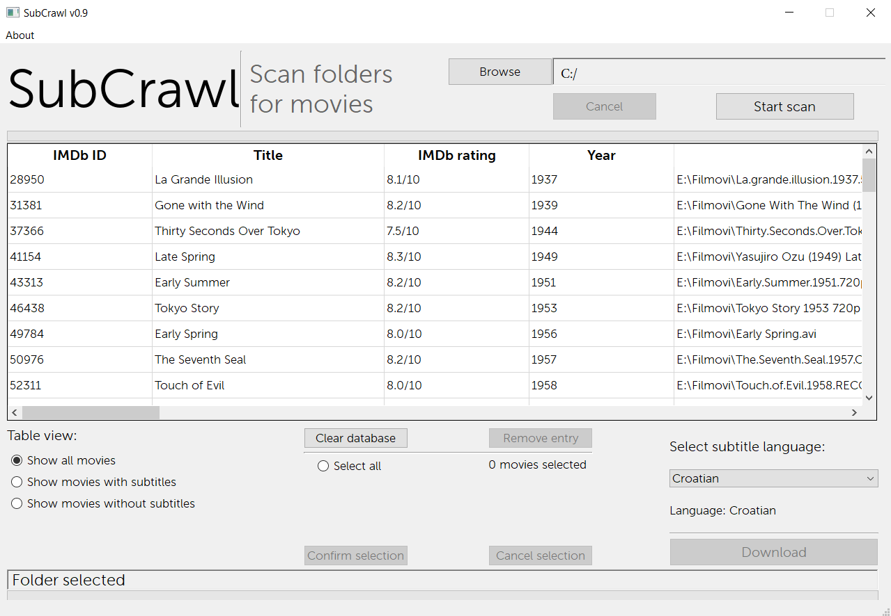

# **SubCrawl**

##### Application for easy scanning of directories for movie files and subtitle downloading.

### What?

The application enables the user to scan a designated directory for movies. :tv:
The application can recognize what file is a movie and can recognize which movie has subtitles. :movie_camera:
After the scanning part is completed, the user can choose which individual movies for which to download the 
subtitles in the selected language, or can simply select all the movies. :japan:
There is also an option to select from which source to download the subtitles if they are available.

### Why?

This is a project I started as a way to learn Python 3 and to get familiar with the process of creating an application. I chose this theme because I could find use out of it (everyone needs subtitles from time to time). I know this type of application probably already exists and that is why I stated already that the primary reason for making this is to learn and grow as a developer. :mortar_board:

### How?

The whole application is built in Python 3. The GUI is built with PyQt5 and is designed in QtDesigner.
File names are parsed using a package called PTN (parse torrent name).

:mega: https://github.com/divijbindlish/parse-torrent-name

Currently, the prime source of downloading subtitle data is OpenSubtitles. 

During the scanning of a selected directory, each recognized media file is compared with the OMDb database to figure out if the file is a movie. After all the movies have been recognized the user can select which ones they want to download subtitles for. When the downloading is initiated the screen is freezed (see issues) and the program logs into their database. After the successful log in it pulls data about the subtitle files and writes those files in their respective movie directories.

Each Python file holds classes which are grouped together thematically:

:star: **main.py** initializes and runs the GUI

:iphone: **gui.py** class Ui_Subcrawl which contains all the code to generate the GUI

:fax: **scanner.py** class Scanner who's task is to scan a designated folder for files and directories

:file_folder: **folder.py** classes Folder and File which help organize the structure of the traversal of files and directories in scanner.py

:clapper: **media.py** classes Media and Movie which are in charge of verifying that the media file is a movie and organizing its data

:page_facing_up: **subtitles.py** class SubtitlePreference which saves the language and source preference that the user chooses and SubtitleDownloader which does the heavy lifting :muscle:

:floppy_disk: **db_interactor.py** class _DBInteractor which is in charge of database interaction, be it storing or retrieving entries

### Want to help?

If you are willing to get your hands dirty and learn as you work, do not hesitate. Contribute with anything you think will improve the application. Beginners and masters of the craft are welcomed to join! :muscle:

Check the open issues and start there. If you can't find anything of interest, let me know and we will find something! :question:

### Note

This project is not yet at a point where it can be used as intended. There are still some issues that need to be resolved before it can be used properly.
